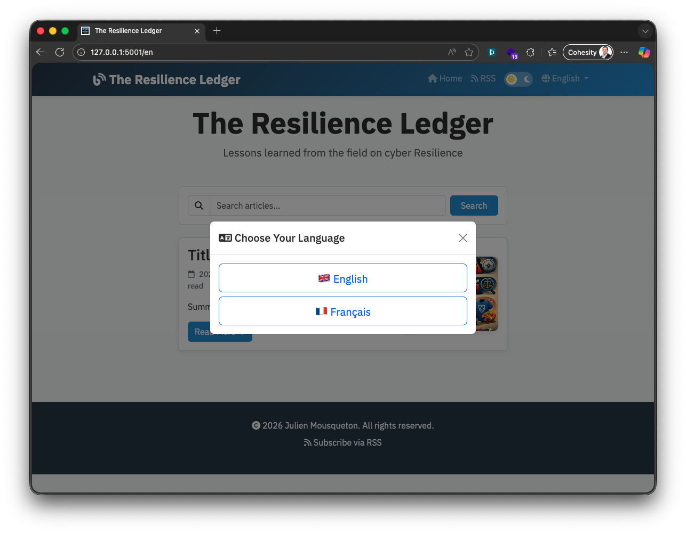
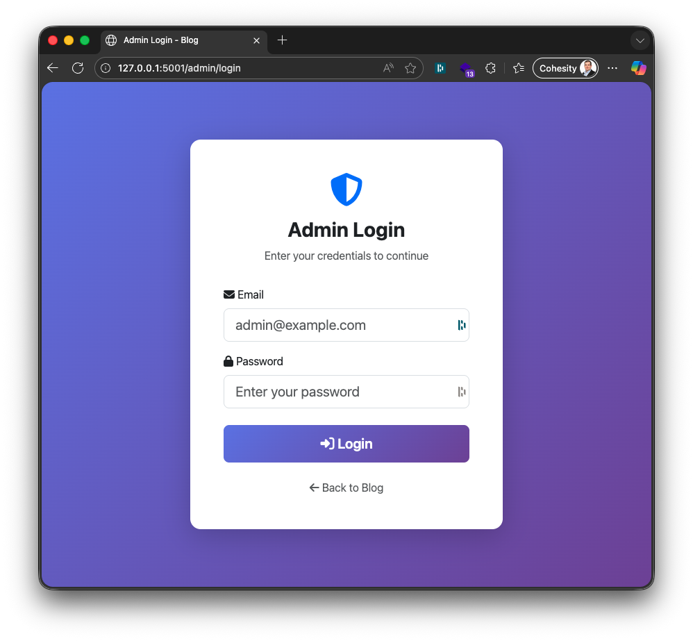
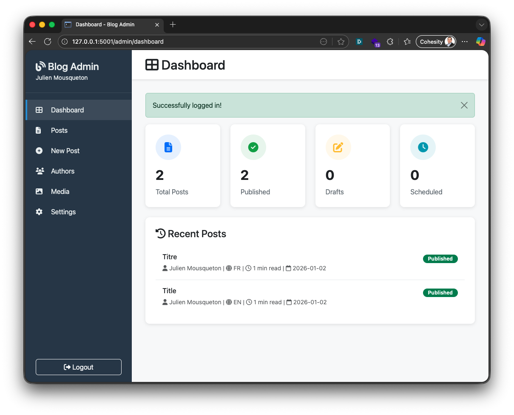
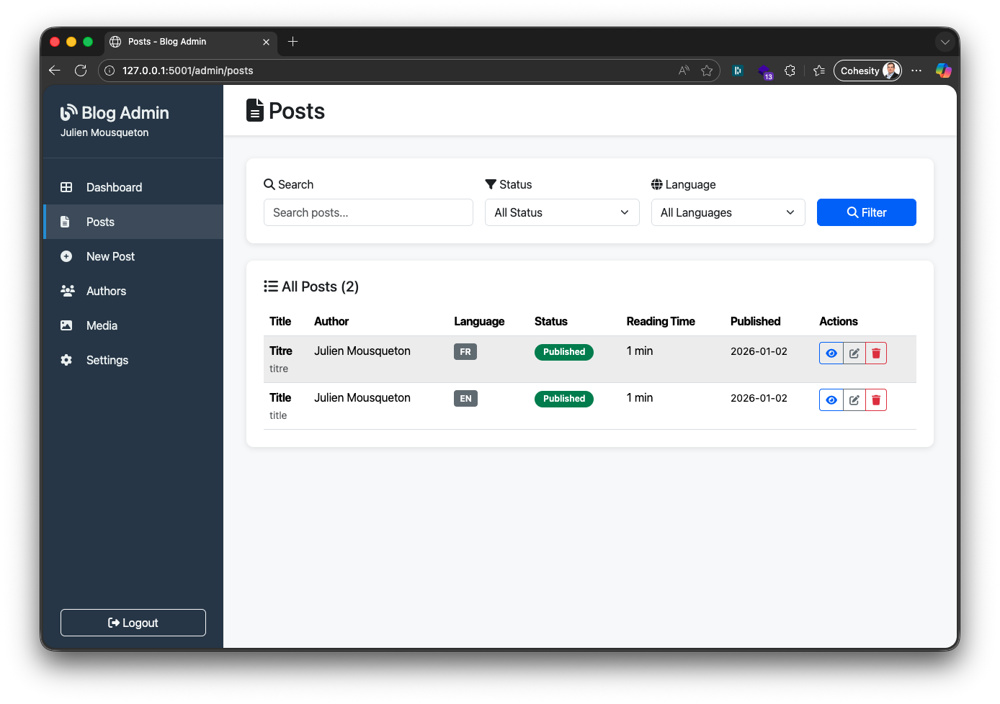
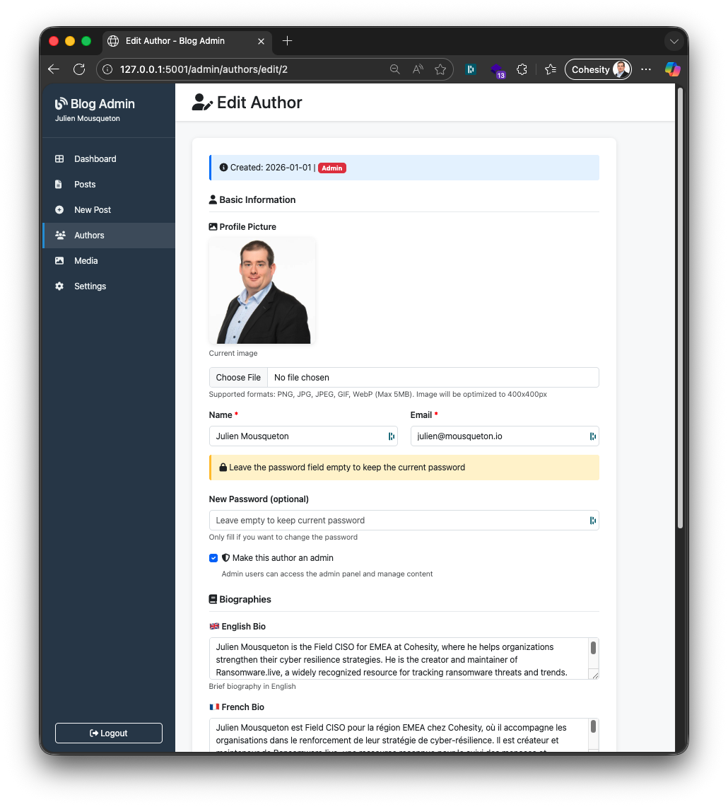
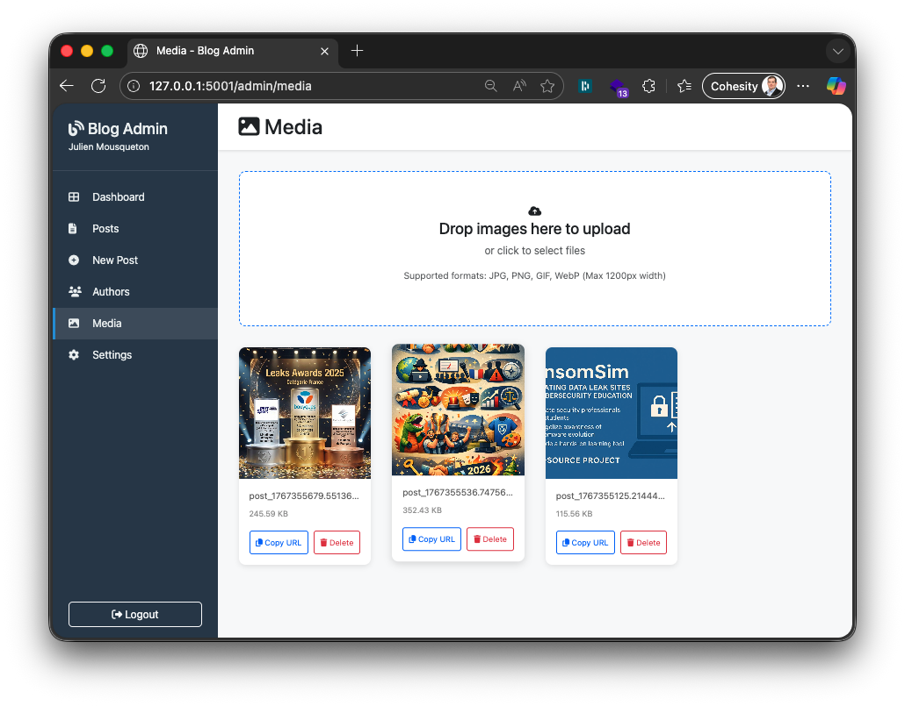
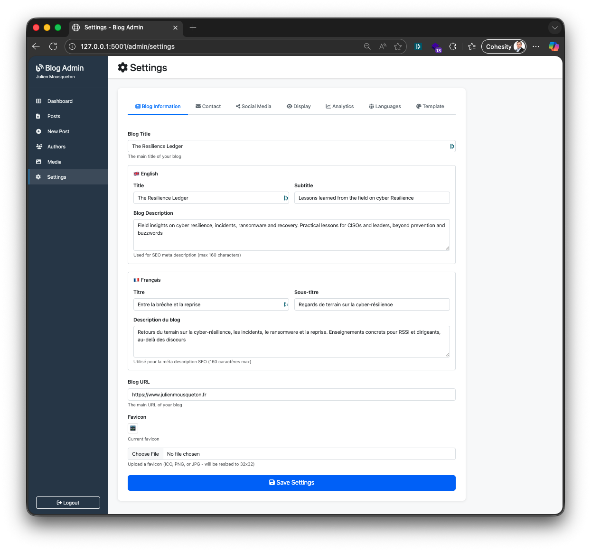
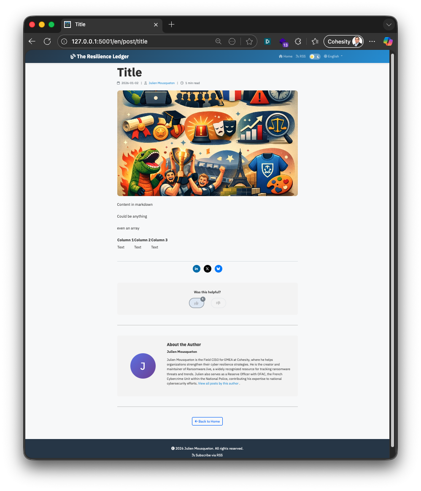

# Multilingual Blog Platform

A modern, feature-rich multilingual blog platform with an intuitive admin interface, built with Flask, Bootstrap 5, and SQLite.

## ✨ Features

### 🌍 Multilingual Support
- **3 Languages**: English (default), French, and German
- **JSON-based i18n**: Easy translation management with external locale files
- **Language Selection**: Automatic detection with cookie persistence
- **Per-language settings**: Customizable titles, subtitles, and descriptions

### 📝 Content Management
- **Full Admin Panel**: Complete WYSIWYG editor with markdown support
- **Post Management**: Draft, Published, and Scheduled statuses
- **Featured Posts**: Pin important articles to the top of the homepage
- **Author Profiles**: Bio, social links, and profile images
- **Media Library**: Upload and manage images
- **Featured Images**: Support for post and author images
- **Reading Time**: Automatic calculation
- **Search**: Full-text search across posts

### 🎨 Design & UX
- **4 Themes**: Default, Light, Dark, and Vibrant
- **Dark Mode Toggle**: Persistent user preference
- **Responsive Design**: Mobile-first Bootstrap 5
- **Smooth Animations**: Page transitions and hover effects
- **Lazy Loading**: Optimized image loading with shimmer effect
- **Custom Favicon**: Upload your own

### 🚀 Performance & SEO
- **RSS Feeds**: Per-language RSS generation
- **SEO Optimized**: Meta tags, Open Graph, Twitter Cards
- **AMP Support**: Accelerated Mobile Pages for lightning-fast mobile experience
- **Sitemap**: Automatic XML sitemap generation
- **Robots.txt**: Search engine configuration
- **Page Transitions**: Smooth fade-in/out effects
- **Auto-Publishing**: Scheduled posts publish automatically

### 💬 Engagement
- **Social Sharing**: LinkedIn, Twitter/X, Bluesky integration
- **Reactions**: Helpful/Not Helpful with localStorage persistence
- **Author Pages**: Dedicated pages for each author

### 🛠️ Developer Features
- **Database Tools**: Export/import scripts for backups
- **Sample Data**: Quick population with test posts
- **Environment Config**: `.env` file support
- **Clean Architecture**: Modular design with utilities

## 🖼️ Screenshots

| Language Picker | Admin Login | Admin Dashboard |
| --- | --- | --- |
|  |  |  |

| Posts | Authors | Media |
| --- | --- | --- |
|  |  |  |

| Settings | Post Page |
| --- | --- |
|  |  |

## 🚀 Quick Start

### Prerequisites
- Python 3.8+
- pip

### Installation

1. **Clone and setup environment**:
```bash
git clone <repository-url>
cd blog
python3 -m venv venv
source venv/bin/activate  # Windows: venv\Scripts\activate
```

2. **Install dependencies**:
```bash
pip install -r requirements.txt
```

3. **Initialize database**:
```bash
python init_db.py
```

4. **Configure environment** (optional):
```bash
cp .env.example .env
# Edit .env with your settings
```

5. **Run the application**:
```bash
./start.sh  # Or: python app.py
```

6. **Access the blog**:
- Blog: `http://localhost:5001`
- Admin: `http://localhost:5001/admin/login`
- Default credentials: See `init_db.py` output

## 📁 Project Structure

```
blog/
├── app.py                  # Main Flask application
├── init_db.py             # Database initialization
├── db_utils.py            # Database utilities
├── requirements.txt       # Python dependencies
├── start.sh              # Startup script
├── locales/              # Translation files
│   ├── en.json
│   ├── fr.json
│   └── de.json
├── scripts/              # Utility scripts
│   ├── export_db.py     # Database backup
│   ├── import_db.py     # Database restore
│   └── add_sample_posts.py
├── static/
│   ├── css/             # Theme stylesheets
│   │   ├── default.css
│   │   ├── light.css
│   │   ├── dark.css
│   │   └── vibrant.css
│   ├── uploads/         # Featured images
│   └── authors/         # Author profile images
└── templates/
    ├── base.html        # Base template
    ├── index.html       # Post listing
    ├── post.html        # Single post view
    ├── author.html      # Author profile
    └── admin/          # Admin templates
```

## 🌐 URL Structure

### Public Routes
- `/` - Redirects to default language
- `/{lang}` - Homepage (en/fr/de)
- `/{lang}/post/{slug}` - Individual post
- `/{lang}/author/{name}` - Author profile
- `/{lang}/rss` - RSS feed
- `/sitemap.xml` - SEO sitemap
- `/robots.txt` - Search engine rules

### Admin Routes
- `/admin/login` - Admin login
- `/admin/dashboard` - Overview (shows full blog stats for all)
- `/admin/posts` - Post management (authors see only their posts; admins see all)
- `/admin/authors` - Author management (admins only)
- `/admin/media` - Media library (admins only)
- `/admin/settings` - Global settings (admins only)
- `/admin/about` - About page
- `/admin/authors/edit/{id}` - My Profile (every logged-in user can edit their profile)

### Admin vs Author Capabilities
- **Admins:** Full access to dashboard, all posts, authors, media, settings, about, and profile
- **Authors:** Access to dashboard (global stats), their own posts (create/edit/delete), About page, and their profile page

## 🗄️ Database Schema

### Tables
- **posts**: Blog posts with multilingual support
- **authors**: Author profiles with social links
- **settings**: Global configuration (key-value store)

### Key Fields (posts)
- `title`, `slug`, `content`
- `language` (en/fr/de)
- `status` (draft/published/scheduled)
- `publish_date`, `author`
- `featured_image`, `excerpt`
- `reading_time` (auto-calculated)

### Key Fields (authors)
- `name`, `bio_en`, `bio_fr`, `bio_de`
- `email`, `website`
- `twitter`, `linkedin`, `github`
- `profile_image`

## 🛠️ Database Management

### Backup Database
```bash
python scripts/export_db.py backup.json --database blog.db
```

### Restore Database
```bash
# Standard restore (appends data)
python scripts/import_db.py backup.json --database blog.db

# Force wipe and restore
python scripts/import_db.py backup.json --database blog.db -F
```

### Add Sample Data
```bash
python scripts/add_sample_posts.py
```

## 🎨 Theme Customization

Themes are CSS files in `static/css/`:
- `default.css` - Professional blue/grey
- `light.css` - Clean light theme
- `dark.css` - Modern dark theme
- `vibrant.css` - Colorful gradient theme

Change themes in Admin → Settings or by editing the `template_css` setting.

## 🌍 Adding New Languages

1. **Create translation file**:
```bash
cp locales/en.json locales/es.json
# Edit es.json with Spanish translations
```

2. **Add language to app.py**:
```python
LANGUAGES = {
    'en': {'name': 'English', 'flag': '🇬🇧'},
    'fr': {'name': 'Français', 'flag': '🇫🇷'},
    'de': {'name': 'Deutsch', 'flag': '🇩🇪'},
    'es': {'name': 'Español', 'flag': '🇪🇸'}  # Add this
}
```

3. **Restart application**

## ⚙️ Configuration

### Environment Variables (.env)
```bash
SECRET_KEY=your-secret-key-here
APP_ID=my-blog
APP_NAME=My Awesome Blog
DEFAULT_LANGUAGE=en
DATABASE_PATH=blog.db
SCHEDULER_INTERVAL=5
```

### Admin Settings (via UI)
- Blog titles (per language)
- Blog subtitles (per language)
- Meta descriptions (per language)
- Theme selection
- Favicon upload
- Language toggles

## 🔒 Security

- Password hashing with werkzeug
- Session-based authentication
- CSRF protection (recommended: add Flask-WTF)
- File upload validation
- SQL injection prevention (parameterized queries)

## 📦 Dependencies

Key packages:
- **Flask** - Web framework
- **Markdown** - Content rendering
- **feedgen** - RSS generation
- **APScheduler** - Scheduled publishing
- **Pillow** - Image processing
- **python-dotenv** - Environment config

See `requirements.txt` for complete list.

## 🤝 Contributing

1. Fork the repository
2. Create a feature branch
3. Make your changes
4. Test thoroughly
5. Submit a pull request

## 📄 License

This project is licensed under the MIT License. See [LICENSE](LICENSE) for details.

## 🙏 Credits

- Built with Flask and Bootstrap 5
- Icons by Font Awesome
- Font: IBM Plex Sans

---

**Made with ❤️ by Julien Mousqueton**
